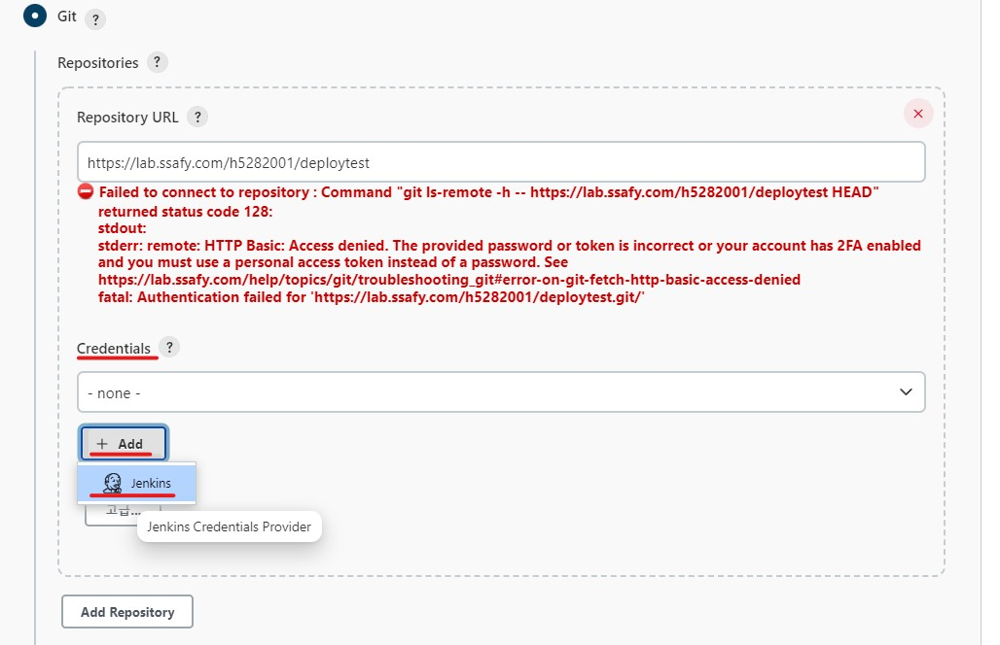
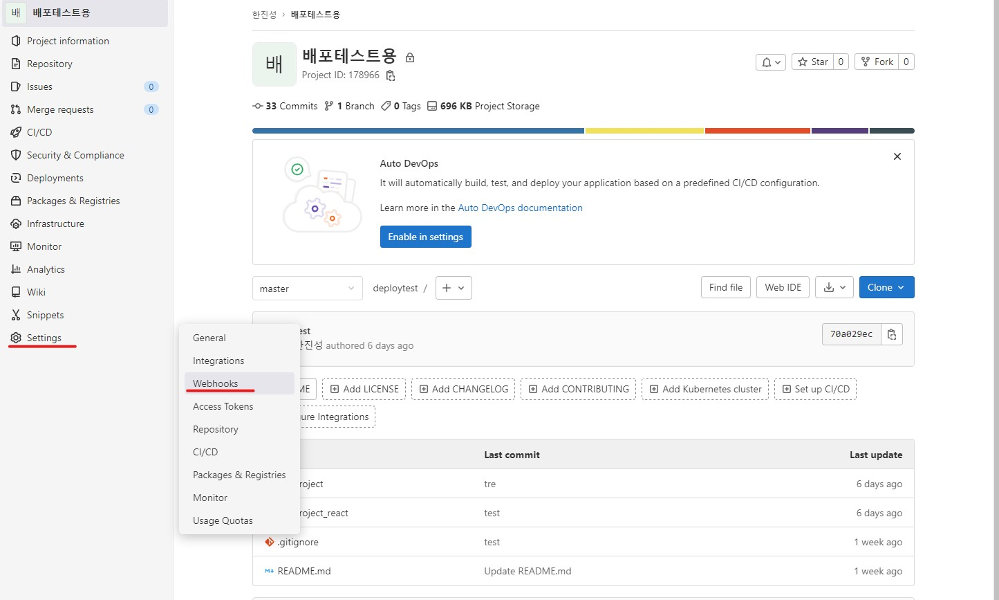
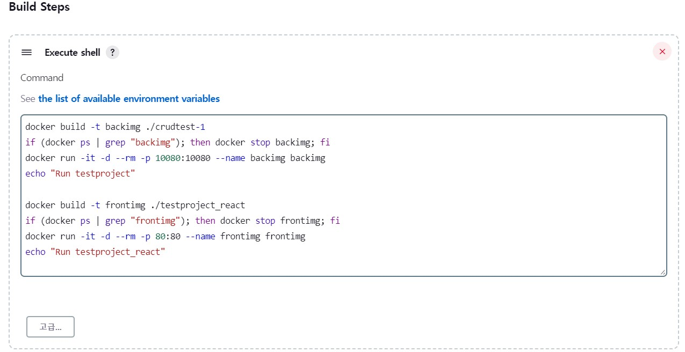
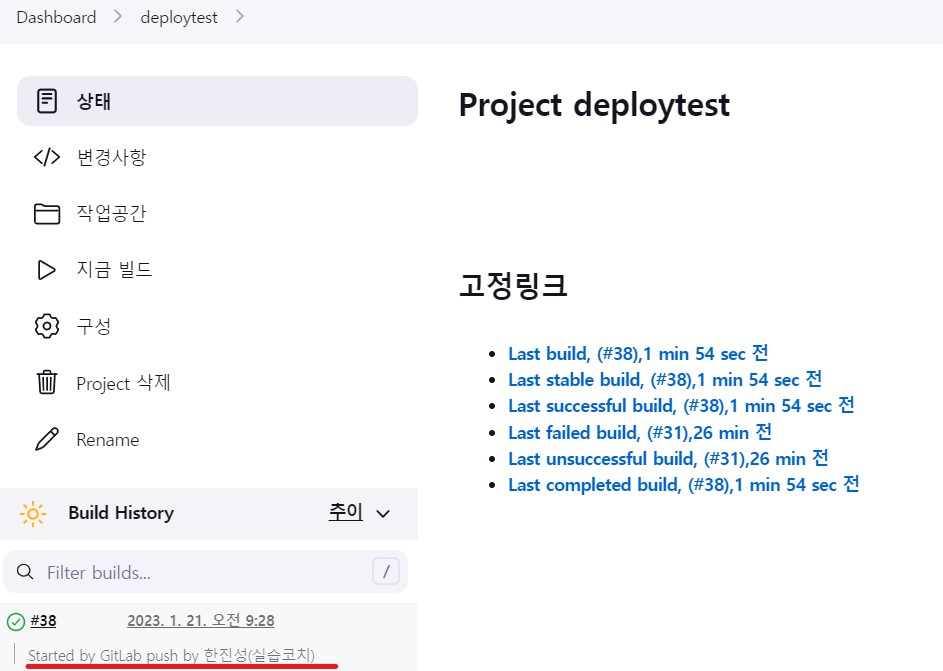

:star: : 이 글은 싸피 깃을 이용하여 Docker, Jenkins를 이용하여 서버를 배포한 경험을 바탕으로 작성하였습니다. 해당 내용은 모두 정답인 방법이 아닙니다. 실습코치의 경험과 방법을 바탕으로 교육생들의 더 원활한 프로젝트를 위해 제공하는 자료입니다!

# 배포 매뉴얼


본 글은 Spring Boot, React, Nginx를 이용하여 CICD 배포를 구축하는 방법에 대해 경험을 기반으로 작성한 글입니다.

 (수정 필요)

위 사진이 구축하고자 하는 그림입니다. 작동 방식은 다음과 같습니다.

1. Gitlab Push Event가 일어나면
2. Jenkins에서 WebHook을 통해 자동으로 빌드를 실행
3. Jenkins에서 각각의 React(Nginx), Spring Boot 프로젝트 내부의 DockerFile를 이용하여 Docker build
4. Jenkins에서 컨테이너 생성 (DooD)
5. 외부에서 접속 : 도커 컨테이너에 올라간 Nginx에서 React와 Spring Boot를 각각 '/', '/api'로 구분지어 연결

## 목차

1. [사전 준비 : AWS EC2 생성하기](#사전-준비--aws-ec2-생성하기)
2. [Docker 설치](#docker-설치)
3. [젠킨스 설치 및 계정 생성](#젠킨스-설치도커-컨테이너-및-계정-생성)
4. [젠킨스 프로젝트 생성, WebHook설정, 자동 빌드 테스트](#젠킨스-프로젝트-생성-webhook-설정-자동-빌드-테스트)
5. [젠킨스 도커 이미지 빌드 & run](#젠킨스와-연결된-gitlab-프로젝트로-도커-이미지-빌드하기)
6. [nginx로 react, Spring Boot 구분지어주기](#nginx를-통해-react와-Spring-Boot-경로-설정)

## 사전 준비 : AWS EC2 생성하기

배포 환경을 구축하기 위해서는 서버용 PC가 필요합니다. 3주차에 싸피에서 지원받은 EC2를 사용하게 됩니다. 여기서는 개인 AWS 계정을 이용하여 EC2를 생성해보겠습니다.

:sparkles: EC2란? : AWS에서 제공하는 클라우드 컴퓨팅 서비스

#### :point_right: 로그인 및 콘솔 접속


aws 로그인 화면입니다. 계정이 없다면 만들어줍시다.


로그인에 성공하면 가장 먼저 해줄 것은 지역 설정입니다. 오른쪽 위의 지역을 클릭하여 서울로 만들어주겠습니다.


위 사진의 경로대로 따라가서 EC2 Management Console에 접속합니다.

#### :point_right: 인스턴스 생성


빨간 상자의 인스턴스 시작 버튼을 클릭해 줍니다.


인스턴스를 생성하는 창입니다. 이름은 적당한 이름으로, OS는 싸피에서 제공되는 OS인 Ubuntu, 버전 정보는 20.04버전을 선택하겠습니다.

#### :point_right: 인스턴스 유형


다음은 인스턴스 유형 칸입니다. 이 부분은 과금이 될 수 있는 부분으로 조심하셔야 합니다. AWS는 신규이용자에 한해서 1년간 프리티어 서비스를 통해 무료로 서버를 대여해주는 것으로 알고 있습니다.

프리티어 사용가능 이라고 적혀있는 유형은 일단은 무료로 이용할 수 있다고 생각하시면 됩니다.

하지만 무료버전에서는 배포 도중 자원 부족으로 서버 다운 등의 문제가 발생할 수 있습니다. 여기서는 잠깐 띄우고 삭제할 예정이므로 t3.medium 유형을 선택해주겠습니다.(시간당 71원 : 24시간 서비스 할 경우 한 달에 약 50000원 :open_mouth:)

[프리티어 메모리 스왑](https://www.google.com/search?q=%ED%94%84%EB%A6%AC%ED%8B%B0%EC%96%B4+%EB%A9%94%EB%AA%A8%EB%A6%AC+%EC%8A%A4%EC%99%91&oq=%ED%94%84%EB%A6%AC%ED%8B%B0%EC%96%B4+%EB%A9%94%EB%AA%A8%EB%A6%AC+%EC%8A%A4%EC%99%91&aqs=chrome..69i57j0i5i30i625.3482j0j4&sourceid=chrome&ie=UTF-8)

#### :point_right: 키 페어 생성


다음으로 새 키 페어 생성을 클릭해줍니다.


적당한 키 페어 이름을 설정하고, 키 페어 생성 버튼을 누르면 pem 파일을 다운로드 받을 수 있습니다. 이 파일은 AWS SSH 로그인이나 젠킨스 SSH 연결 등에 사용되는 중요한 키이므로 잘 저장해 둡시다.


키 페어에 생성한 키를 선택해줍니다.

#### :point_right: 네트워크 설정

다음은 네트워크 설정입니다. 위 사진의 편집 버튼을 클릭해줍니다.

네트워크 설정은 기본적으로 22번 Port, SSH 연결만 허용되어 있습니다. 몇 가지 포트를 허용하는 규칙을 추가해보겠습니다.


보안 그룹 규칙 추가 버튼을 클릭합니다.


HTTP와 같이 80포트로 정해져 있는 것은 선택하여 바로 규칙으로 추가할 수 있고, 사용자 지정 포트도 규칙에 추가하여 허용해줄 수 있습니다.

저는 HTTP, HTTPS, 9090(jenkins), 8080(Spring Boot Nginx 연결 이전) 포트를 개방해주었습니다.


그 아래의 소스 유형의 경우에는 접근 가능한 IP를 설정해 주는 부분입니다. 위치 무관을 선택하면 어디서든 해당 포트로 접속(0.0.0.0)이 가능합니다.

#### :point_right: 스토리지 구성


스토리지는 프리티어 단계에서 최대 30GB까지 무료로 제공됩니다. 그 이상부터는 과금이 들어갑니다.

#### :point_right: 인스턴스 시작


여기까지 설정이 완료되었으면 인스턴스 시작 버튼을 클릭하여 인스턴스를 시작하면 됩니다.


인스턴스 시작 성공 화면입니다.

#### :point_right: 탄력적 IP


인스턴스 목록 창을 보면 방금 생성한 인스턴스가 있는 것을 확인할 수 있습니다.

제가 기존에 생성했던 인스턴스와 비교해보면 밑줄 쳐놓은 부분이 다른 것을 확인할 수 있습니다.

AWS에서는 인스턴스에 대해 퍼블릭 IP를 제공합니다. 하지만 이는 유동적으로 제공되는 IP로, 인스턴스를 중지했다가 다시 시작하면 기존의 IP가 아닌 새로운 IP가 부여되게 됩니다.

만약 서비스를 재시작했는데, 접속 IP가 변경되면 해당 서버에 접속하기가 어려워지겠죠? 그래서, AWS는 탄력적 IP를 제공함으로써 고정된 Public IP를 사용할 수 있게 해주었습니다.

탄력적 IP역시 과금이 들어가는 부분이 있습니다. 자세히는 모르지만 한 개만 사용할 때는 요금이 들지 않고, 1개 초과로 사용할 경우 요금이 발생하는 것으로 알고있습니다.


탄력적 IP 생성을 하기 위해 탭에서 탄력적 IP로 이동합니다.


할당 버튼을 클릭하면 탄력적 IP가 생성됩니다. 저는 미리 만들어둔 IP가 있으므로 생략하겠습니다.

이제, 할당한 탄력적 IP를 인스턴스에 연결해보겠습니다.


빨간색으로 칠해진 부분을 클릭합니다.


탄력적 IP 주소 연결 버튼을 클릭합니다.


인스턴스를 선택해주고, 재연결 허용여부 체크박스를 체크해줍니다. 그 후 연결 버튼 클릭 시 연결 완료입니다.

#### :point_right: SSH 연결


PC에서 SSH 연결을 진행해보겠습니다. 아까 키 페어 생성할 때 다운받은 Pem 파일이 있는 폴더에서 다음 명령어를 입력합니다. 이후 yes를 입력하면 접속이 완료됩니다.


:satisfied: 여기까지 완료했으면 AWS 세팅은 완료되었습니다! 싸피에서 EC2를 제공받을 경우 AWS 관련 설정이 다를 수 있습니다.

## Docker 설치

Ubuntu 환경이 준비되었습니다. 여기에 Docker를 먼저 설치하겠습니다.

[참고 링크](https://dongle94.github.io/docker/docker-ubuntu-install/)

도커 설치를 위해 필요한 패키지들을 설치합니다. 설치 명령어는 다음과 같습니다.

#### :point_right: 사전 패키지 설치

```
sudo apt update
sudo apt-get install -y ca-certificates \
    curl \
    software-properties-common \
    apt-transport-https \
    gnupg \
    lsb-release
```

도커를 설치하기 위해 gpg Key를 다운받아야 합니다. 이는 리눅스 패키지 툴이 프로그램 패키지가 유효한지 확인하기 위해 설치 전에 gpg 키를 통해 검증하는 과정을 거치기 때문에 gpg 키를 받아야 한다고 합니다.

#### :point_right: gpg 키 다운로드

```
sudo mkdir -p /etc/apt/keyrings
curl -fsSL https://download.docker.com/linux/ubuntu/gpg | sudo gpg --dearmor -o /etc/apt/keyrings/docker.gpg

echo \
    "deb [arch=$(dpkg --print-architecture) signed-by=/etc/apt/keyrings/docker.gpg] https://download.docker.com/linux/ubuntu \
    $(lsb_release -cs) stable" | sudo tee /etc/apt/sources.list.d/docker.list > /dev/null
```

#### :point_right: Docker 설치

`apt update`를 다시 실행해주고, 아래 명령어를 통해 도커를 설치합니다. `docker-compose`는 추가로 설치합니다.(젠킨스 설치할 때 편하게 하기 위해 씁니다. 다른 사용법도 있는데 저는 이번에는 쓰지 않았습니다.)

```
sudo apt update
sudo apt install docker-ce docker-ce-cli containerd.io docker-compose
```

여기까지 하면 EC2에 도커 설치는 완료되었습니다.

## 젠킨스 설치(도커 컨테이너) 및 계정 생성

참고사항
- [참고 링크](dongyeon1201.kr/9026133b-31be-4b58-bcc7-49abbe893044)

#### :point_right: docker-compose 이용 젠킨스 컨테이너 생성

다음은 도커에 젠킨스를 이미지를 이용해 설치해보겠습니다.


위 사진과 같이 명령어를 쳐서 `docker-compose.yml` 파일을 vim을 이용하여 생성해줍니다.

docker-compose.yml 파일
```
version: '3'

services:
    jenkins:
        image: jenkins/jenkins:lts
        container_name: jenkins
        volumes:
            - /var/run/docker.sock:/var/run/docker.sock
            - /jenkins:/var/jenkins_home
        ports:
            - "9090:8080"
        privileged: true
        user: root
```

위 내용을 복사하여 붙여넣기합니다. 각 단어에 대한 설명은 간단하게만 하겠습니다.

- services : 컨테이너 서비스
- jenkins : 서비스 이름
- image : 컨테이너 생성시 사용할 image, 여기서는 jenkins/jenkins:lts 이미지를 사용(jenkins의 lts버전을 가져온다는 뜻)
- container_name : 컨테이너 이름
- volumes : 공유 폴더 느낌, aws의 /var/run/docker.sock와 컨테이너 내부의 /var/run/docker.sock를 연결, /jenkins 폴더와 /var/jenkins_home 폴더를 연결.
- ports : 포트 매핑, aws의 9090 포트와 컨테이너의 8080 포트를 연결한다.
- privileged : 컨테이너 시스템의 주요 자원에 연결할 수 있게 하는 것 기본적으로 False로 한다고 한다.
- user : 젠킨스에 접속할 유저 계정 (root로 할 경우 관리자 - 관리자를 유저로 설정하면 보안상 매우 취약하므로 별도의 사용자 계정을 만들어 등록하는 것이 좋다.)


이후 esc를 누른 후 :wq 를 입력하여 파일을 저장합니다.


`sudo docker-compose up -d` 명령어를 입력하여 컨테이너를 생성해줍니다.


`sudo docker ps` 명령어로 확인해보면 다음과 같이 컨테이너가 올라가 있는 것을 확인할 수 있습니다.

#### :point_right: 젠킨스 계정 생성 및 플러그인 설치


서버 공인  IP:9090 포트로 접속하면 다음과 같은 젠킨스 시작 화면이 나타나게 됩니다.


여기서 말하는 Administrator password는 `sudo docker logs jenkins` 명령어를 통해 위 사진의 빨간 네모 상자 안의 값을 입력해줍니다.

다음으로 두 개의 버튼 중 `Install suggested plugins`를 클릭해줍니다.(기본 플러그인 자동 설치 느낌, 다른 버튼은 사용자 지정 플러그인 설치 같은 느낌입니다.)


이것 저것 플러그인들이 설치되는 모습입니다.


젠킨스 계정 생성 form입니다. 적당히 입력하고 `Save and Continue` 버튼을 눌러줍니다.

이후 `Save and Finish`, `Start using Jenkins` 버튼을 이어서 눌러 젠킨스를 시작해줍니다.


젠킨스 시작 메인화면입니다. 플러그인 설치를 위해 jenkins 관리 탭을 클릭해줍니다.


플러그인 관리 페이지로 이동합니다.


먼저 설치 가능 탭으로 탭을 변경해주고, 검색어에 `gitlab`을 검색합니다.

그 후, 밑줄 친 플러그인들을 체크하고, `install witout restart` 버튼을 클릭해줍니다.


같은 방식으로 Docker 관련 플러그인도 설치해줍니다.


마지막으로 SSH 연결 관련 플러그인까지 설치하겠습니다.


모두 설치가 완료되었습니다.

## 젠킨스 프로젝트 생성 WebHook 설정, 자동 빌드 테스트

참고사항
- [참고 링크](https://zunoxi.tistory.com/106)

이제, 젠킨스에서 프로젝트를 생성하고, 깃랩과 WebHook으로 연결하여 자동으로 빌드를 진행하는 것을 테스트하겠습니다.

#### :point_right: 깃랩 Repo 생성

깃랩 레포지토리 생성 부분은 모두 잘 알고 있을 거라고 생각하여 스킵하고, 제가 구성한 레포지토리가 어떻게 되어있는지 간단하게 설명만 하겠습니다.


여기서는 Spring Boot와 React를 이용하여 배포를 진행할 것이기 때문에 폴더로 구분지어 각각 Spring Boot, React 프로젝트를 설치해두었습니다.

`crudtest-1`는 Spring Boot 프로젝트, `testproject_react`는 React 프로젝트입니다.   

#### :point_right: 젠킨스 프로젝트 생성


젠킨스 메인페이지에서 `새로운 item` 을 클릭합니다.


프로젝트 이름은 `deploytest`, `Freestyle project`를 클릭하고 `OK` 버튼을 클릭합니다.


`소스코드 관리` 탭을 클릭하고, None로 되어있는 것을 git 라디오 버튼을 클릭하면 아래에 Form이 나타납니다.

아래에 있는 밑줄은 빌드할 브랜치 이름을 적어줍니다. 테스트 프로젝트에서는 편의상 master로 브랜치를 설정했지만, 실제로는 각 팀 별 깃 플로우 전략에 따라 브랜치를 작성해주시기 바랍니다.


`Repository URL`에는 싸피깃 레포지토리 URL을 입력해줍니다. 위 사진처럼 에러 메시지가 나타나는 것이 지금 단계에서는 정상입니다.



`Credentials`에서, `add` -> `jenkins`를 클릭해줍니다.


- Username : 싸피깃 아이디
- Password : 싸피깃 비밀번호
- ID : Credential 구별할 아무 텍스트 입력하면 됩니다.

위 내용 입력하고 `Add` 버튼 클릭합니다.


 `Credentials`에서 이제 만들어진 `Credential`을 선택했을 때 오류메시지가 사라지면 성공입니다.


다음은 빌드 유발 탭입니다. 빌드 유발 탭에서는 먼저 밑줄 친 부분의 체크박스를 체크해줍니다. 그 후 생기는 고급 버튼을 클릭합니다.


그 후 조금 스크롤을 내려 `Secret token`을 찾아 Generate 버튼을 누르면 사진과 같이 토큰이 생성됩니다. 이 토큰은 Gitlab과 WebHook을 연결할 때 사용되니 저장해둡니다.


다음은 Build 탭입니다. `Add build step`를 클릭하고, `Execute Shell`을 선택해줍니다.


다음과 같이 명령어를 입력할 수 있는 칸이 나타납니다. 일단 연결만 테스트하는 것이기 때문에 pwd 명령어를 입력하겠습니다.

여기까지 모두 완료했다면 저장 버튼을 눌러 저장합니다.


저장 버튼을 누르면 위 사진처럼 프로젝트 화면으로 이동합니다. 일단 `지금 빌드` 버튼을 눌러서 젠킨스 수동 빌드를 진행해봅니다. 아래 밑줄처럼 완료 표시가 뜨면 성공한 것입니다.


빌드 히스토리에서, `Console Output`에 들어가보겠습니다.


빌드에 성공한 console 창입니다. 입력해두었던 명령어 pwd도 잘 작동한 것을 확인할 수 있습니다.

#### :point_right: 깃랩 WebHook 연결

다음은 싸피깃 레포지토리와 젠킨스를 `WebHook`으로 연결하여 자동 빌드를 진행해보겠습니다.



배포할 프로젝트가 있는 깃랩 `Repository`에서 밑줄친 위치로 `WebHooks` 페이지로 이동합니다.


URL에는 `http://배포서버공인IP:9090/project/생성한jenkins프로젝트이름/`을 입력해줍니다.

Secret token에는 아까 위에서 젠킨스 프로젝트를 생성할 때 저장해둔 값을 입력합니다.

빌드 유발 Trigger으로, `Push events, Merge request events`를 설정합니다. 대상 Branch는 master으로 설정합니다.

완료했다면 Add Webhook 버튼을 눌러 webhook을 생성합니다.


WebHook을 생성하고 나면 빌드 테스트를 위해 생성된 WebHook에서 test를 누르고, Push events를 선택해줍니다.


응답이 잘 넘어온 것을 확인할 수 있습니다. (code 200)


젠킨스에서도 정상적으로 빌드가 수행되는 것을 확인할 수 있습니다.

:satisfied: 여기까지 완료했으면 이제 `Jenkins`와 `Gitlab`이 연결되었습니다! 연결된 `Gitlab`의 `master branch`에 이벤트가 발생하면, 젠킨스에서는 빌드를 수행하게 됩니다!

## 젠킨스와 연결된 gitlab 프로젝트로 도커 이미지 빌드하기

참고사항
- [참고 링크](https://sinawi.tistory.com/371)

젠킨스에서 도커 빌드를 하기 위해서는 젠킨스 컨테이너 안에 도커를 설치해야 합니다. 도커 설치 방법은 Ec2에 도커를 설치할 때와 동일하게 진행합니다.

먼저 젠킨스 bash shell에 접근해보겠습니다. 명령어는 `sudo docker exec -it jenkins bash` 입니다.


정상적으로 접속되면 다음과 같은 화면이 됩니다. 이제 이 환경에 docker를 다시 설치하도록 합니다.

#### :point_right: 사전 패키지 설치

```
apt update
apt-get install -y ca-certificates \
    curl \
    software-properties-common \
    apt-transport-https \
    gnupg \
    lsb-release
```

루트계정으로 접속되어있기 때문에, 젠킨스 컨테이너 내부에서는 명령어에 sudo를 지워야합니다.

#### :point_right: gpg 키 다운로드

```
mkdir -p /etc/apt/keyrings
curl -fsSL https://download.docker.com/linux/debian/gpg | gpg --dearmor -o /etc/apt/keyrings/docker.gpg

echo \
    "deb [arch=$(dpkg --print-architecture) signed-by=/etc/apt/keyrings/docker.gpg] https://download.docker.com/linux/debian \
    $(lsb_release -cs) stable" | tee /etc/apt/sources.list.d/docker.list > /dev/null
```

젠킨스에 gpg 키를 다운로드 받을 때의 변경사항입니다.


젠킨스 컨테이너 내부에서 설치된 `os`을 체크하는 명령어 `cat /etc/issue`를 통해 `os`를 확인해보면 `debian`으로 나타나는 것을 확인할 수 있습니다.

기존 링크에서 제공한 방식은 `ubuntu os`에 대한 `gpg` 키를 다운로드 하는 것이기 때문에, 이를 `debian`으로 바꾸어주어야 합니다.

이를 바꾸지 않으면 패키지를 찾지 못하는 에러가 발생합니다.

기존 명령어에서 `ubuntu`로 되어있는 부분을 `debian`으로 바꾸어주면 해결됩니다.

#### :point_right: Docker 설치

```
apt update
apt install docker-ce docker-ce-cli containerd.io docker-compose
```

여기까지 진행하면 `Jenkins Container`에도 `Docker`가 설치 완료되었습니다.

#### :point_right: 프로젝트에 DockerFile 작성

이제 깃랩의 각 프로젝트 폴더에 DockerFile을 만들어 명령어를 입력해주겠습니다.

Spring Boot Project DockerFile
```
FROM adoptopenjdk/openjdk11 AS builder
COPY gradlew .
COPY gradle gradle
COPY build.gradle .
COPY settings.gradle .
COPY src src
RUN chmod +x ./gradlew
RUN ./gradlew bootJAR

FROM adoptopenjdk/openjdk11
COPY --from=builder build/libs/*.jar app.jar
EXPOSE 8080
ENTRYPOINT ["java", "-jar", "/app.jar"]
```

React Project DockerFile
```
FROM node:16.15.0 as build-stage
WORKDIR /var/jenkins_home/workspace/deploytest/testproject_react
COPY package*.json ./
RUN npm install
COPY . .
RUN npm run build
FROM nginx:stable-alpine as production-stage

COPY --from=build-stage /var/jenkins_home/workspace/deploytest/testproject_react/build /usr/share/nginx/html
#COPY --from=build-stage /var/jenkins_home/workspace/deploytest/testproject_react/deploy_conf/nginx.conf /etc/nginx/conf.d/default.conf
EXPOSE 80
CMD ["nginx", "-g","daemon off;"]
```
간단 명령어 설명
- FROM : 베이스 이미지를 지정
- WORKDIR : 작업 디렉토리 설정
- COPY : 파일 복사 <Host 파일 경로> <Docker 이미지 파일 경로>
- RUN : 명령 실행
- CMD 컨테이너 실행 명령
- EXPORT : 포트 익스포트

`React DockerFile`에서는 먼저 `node:16.15.0` 이미지를 베이스 이미지로 둡니다. as `build-stage`는 이미지를 지칭하는 별명을 말합니다.

그 후 `package*.json`에 등록되어있는 라이브러리들을 `npm install`으로 설치하고, 프로젝트 폴더를 이미지에 복사, `npm run build`를 통해 build폴더에 빌드한 프로젝트(static 파일)가 저장됩니다.

실제 컨테이너로 생성되는 건 다음 이미지인데요, `nginx:stable-alpine` 이미지를 베이스로 설정하고, COPY의 옵션으로 `--from=build-stage` 를 통해 아까 빌드했던 파일들을 nginx의 서비스 폴더인 `/usr/share/nginx/html`으로 복사합니다.

그 후 80포트로 익스포팅 하고 CMD를 통해 nginx를 백그라운드에서 실행하는 컨테이너를 실행하도록 하였습니다.

:sparkles: Vue.js의 경우 npm run build를 했을 때 생성되는 폴더가 build가 아닌 dist이므로 폴더명에 주의해주시면 됩니다!

React 도커파일에서 #으로 주석처리한 부분은 nginx 설정에 사용되는 부분입니다. 뒤에서 nginx 설정할 때 설명하겠습니다.

프로젝트의 도커 파일 설정은 이제 완료되었습니다! 다음은 젠킨스에서 이 도커파일을 이용해서 이미지를 생성하도록 해보겠습니다.

#### :point_right: 젠킨스에서 DockerFile 이용 도커 이미지 생성


젠킨스 프로젝트 페이지에서, 구성 버튼을 클릭합니다.



그럼 아까 프로젝트 생성할 때의 창과 비슷한 창이 나타납니다. Build 탭으로 이동하고, 아까 프로젝트 생성할 때 pwd로 적어두었던 명령어를 다음 명령어로 바꾸어줍니다.

```
docker build -t backimg ./crudtest-1
if (docker ps | grep "backimg"); then docker stop backimg; fi
docker run -it -d --rm -p 8080:8080 --name backimg backimg
echo "Run testproject"

docker build -t frontimg ./testproject_react
if (docker ps | grep "frontimg"); then docker stop frontimg; fi
docker run -it -d --rm -p 80:80 --name frontimg frontimg
echo "Run testproject_react"
```

위 명령어에 대한 개별 설명

docker build -t backimg ./crudtest-1 : 도커 이미지 빌드(Spring 프로젝트)
- if (docker ps | grep "backimg"); then docker stop backimg; fi : 만약 'backimg' 컨테이너가 이미 있다면 stop시키기
- docker run -it -d --rm -p 8080:8080 --name backimg backimg : 8080포트로 도커 컨테이너 run
- docker build -t frontimg ./testproject_react : 도커 이미지 빌드(React 프로젝트)
- if (docker ps | grep "frontimg"); then docker stop frontimg; fi : 만약 'frontimg' 컨테이너가 이미 있다면 stop시키기
- docker run -it -d --rm -p 80:80 --name frontimg frontimg : 80포트로 도커 컨테이너 run

이후 저장 버튼을 눌러줍니다.


이제 지금 빌드 버튼을 눌러 빌드해주면.


콘솔에서 결과를 확인할 수 있고.


서버의 80포트(HTTP)에는 React를 확인할 수 있습니다.

개인 서버에서 8080 포트를 열어두셨다면, spring boot 서버도 확인이 가능합니다.

1. Gitlab Push Event가 일어나면
2. Jenkins에서 WebHook을 통해 자동으로 빌드를 실행
3. Jenkins에서 각각의 React(Nginx), Spring Boot 프로젝트 내부의 DockerFile를 이용하여 Dockerimage 및 컨테이너 생성
4. 외부에서 접속 : 도커 컨테이너에 올라간 Nginx에서 React와 Spring Boot를 각각 '/', '/api'로 구분지어 연결

처음 설명했던 작동방식 1~4중에서 3번까지 완료되었습니다. 다음은 정말 마지막 설정인 Nginx Reverse Proxy 설정입니다.

## Nginx를 통해 React와 Spring Boot 경로 설정

SSAFY의 EC2는 허용하는 포트에 제한이 걸리기 떄문에, Reverse Proxy 작업을 하지 않으면 서버에 접근이 불가능한 경우가 생길 수 있습니다.
따라서 80 Port에서 백과 프론트, 두 서비스를 구분 짓는 부분이 필요합니다.

마지막 Nginx 설정 부분입니다. 이 과정은, 기존 리액트와 포트가 분리되어 8080 포트를 이용해야 접속 가능한 백엔드 서비스를 80 포트를 통해 접속할 수 있도록 변경시켜주는 작업입니다.


#### :point_right: nginx.conf 파일 생성


리액트 프로젝트 폴더 아래에 폴더를 deploy_conf 폴더를 생성해줍니다. 그 후 nginx.conf 파일을 생성하여 아래 내용을 입력해줍니다.

nginx.conf 파일
```
upstream backend{
	ip_hash;
	server 172.26.8.156:8080;
}

server {
    listen       80;
    listen  [::]:80;
    server_name  t8c22.p.ssafy.io;

    #access_log  /var/log/nginx/host.access.log  main;

    location / {
        root   /usr/share/nginx/html;
        index  index.html index.htm;
    }

	location /api {
        proxy_pass http://backend/;
        proxy_redirect     off;
        proxy_set_header   Host $host;
        proxy_set_header   X-Real-IP $remote_addr;
        proxy_set_header   X-Forwarded-For $proxy_add_x_forwarded_for;
    }

    #error_page  404              /404.html;

    # redirect server error pages to the static page /50x.html
    #
    error_page   500 502 503 504  /50x.html;
    location = /50x.html {
        root   /usr/share/nginx/html;
    }

    # proxy the PHP scripts to Apache listening on 127.0.0.1:80
    #
    #location ~ \.php$ {
    #    proxy_pass   http://127.0.0.1;
    #}

    # pass the PHP scripts to FastCGI server listening on 127.0.0.1:9000
    #
    #location ~ \.php$ {
    #    root           html;
    #    fastcgi_pass   127.0.0.1:9000;
    #    fastcgi_index  index.php;
    #    fastcgi_param  SCRIPT_FILENAME  /scripts$fastcgi_script_name;
    #    include        fastcgi_params;
    #}

    # deny access to .htaccess files, if Apache's document root
    # concurs with nginx's one
    #
    #location ~ /\.ht {
    #    deny  all;
    #}
}
```

:sparkles: 위에서부터 3번째 줄, 172.26.8.156 ip 주소는 EC2 인스턴스의 Private ip 주소입니다.

파일에는 다음 내용을 복사 붙여넣기 해줍니다.

nginx 설정 파일에 대해 간략하게 설명하면,

upstream 을 통해서 backend를 로컬 ip:8080 주소와 연결시키고,

해당 주소를 location /api 에 연결시켰습니다.

기존 리액트 프로젝트는 location / 에 연결됩니다.

결과적으로 공인 ip주소/api로 요청을 하게 되면 Nginx에서 스프링서버로 연결을 시켜주게됩니다.

nginx와 스프링 서버사이의 통신은 로컬에서 이루어지기 때문에 공인 IP를 등록할 필요가 없습니다.

`nginx.conf` 파일 작성을 마쳤다면 `esc, :wq` 를 통해 파일을 저장해줍니다.

#### :point_right: DockerFIle 수정

```
FROM node:16.15.0 as build-stage
WORKDIR /var/jenkins_home/workspace/deploytest/testproject_react
COPY package*.json ./
RUN npm install
COPY . .
RUN npm run build
FROM nginx:stable-alpine as production-stage

COPY --from=build-stage /var/jenkins_home/workspace/deploytest/testproject_react/build /usr/share/nginx/html
COPY --from=build-stage /var/jenkins_home/workspace/deploytest/testproject_react/deploy_conf/nginx.conf /etc/nginx/conf.d/default.conf
EXPOSE 80
CMD ["nginx", "-g","daemon off;"]
```

앞서 DockerFile 만들 때, #으로 주석처리 했던 부분을 해제해줍니다. 이 부분은 방금 생성한 nginx 설정 파일을 nginx 이미지로 옮기는 명령어였습니다.

#### :point_right: 최종 빌드 테스트

도커파일이 수정사항을 반영시키려면, gitlab에 Push 해주어야합니다! 최종적으로 모든 기능이 잘 작동하는지 테스트 할 수 있는 기회가 되겠네요.


수정사항을 `master Branch`에 `Push`합니다.



`jenkins`에서 `push trigger`를 받아 `build`를 수행합니다.


일하고 있는 할아버지 :cry:


빌드가 완료된 후, `http://공인ip/` 로 접속하면 React가


`http://공인ip/api` 로 접속하면 Spring Boot가 실행되는 걸 확인할 수 있습니다.

스프링에서는 swagger를 적용하여 swagger 페이지를 확인했습니다.

이로써 모든 기능 구현이 완료되었습니다! nginx 에 https 적용시키는 부분은 이후에 추가로 가이드 하겠습니다!

이상 CICD 배포 매뉴얼 V2였습니다.
